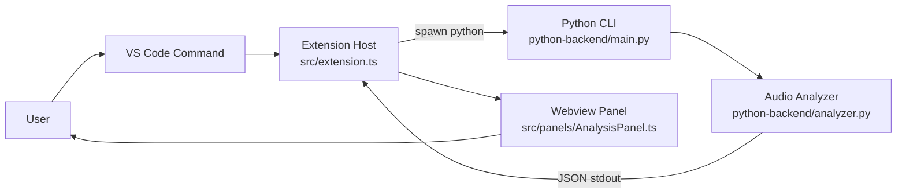
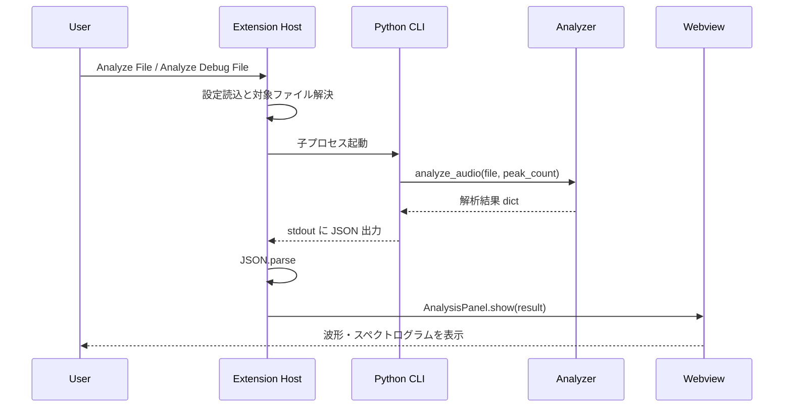

# Audio Wandas Analyzer Architecture

## 概要

このプロジェクトは、VS Code 拡張機能のフロントエンドと Python 製の解析バックエンドを分離した三層構成です。

- Extension Host 層: コマンド登録、設定取得、ファイル選択、Python プロセス起動を担当
- Python Backend 層: 音声解析、数値計算、JSON 形式の結果生成を担当
- Webview UI 層: 解析結果の描画、ズームやホバーなどのインタラクションを担当

設計上の主眼は、VS Code 固有処理と信号処理ロジックを切り離し、UI と解析処理を疎結合に保つことです。

## 全体構成



## コンポーネント責務

### 1. Extension Host

対象: [src/extension.ts](/workspaces/audio-wandas-analyzer/src/extension.ts)

責務:

- VS Code コマンド `audioWandasAnalyzer.analyzeFile` と `audioWandasAnalyzer.analyzeDebugFile` を登録する
- 対象音声ファイルを選択または解決する
- 設定値 `pythonCommand`、`defaultPeakCount`、`debugFilePath` を読み込む
- Python バックエンドを子プロセスとして起動する
- 標準出力の JSON を `AnalysisResult` として解釈する
- 成功時は Webview を開き、失敗時は VS Code 通知にエラーを表示する

特徴:

- バックエンドとの境界はプロセス実行と JSON 入出力だけに限定されている
- 解析ロジックを TypeScript 側に持たないため、UI 修正と数値処理修正を独立して進めやすい

### 2. Python CLI Entry Point

対象: [python-backend/main.py](/workspaces/audio-wandas-analyzer/python-backend/main.py)

責務:

- コマンドライン引数 `--file` と `--peaks` を受け取る
- `analyze_audio` を呼び出す
- 解析結果を JSON として標準出力に書き出す
- 例外発生時は標準エラー出力にメッセージを出し、非ゼロ終了コードで終了する

特徴:

- CLI を薄く保つことで、解析本体のテストや再利用をしやすくしている
- VS Code 拡張以外の呼び出し元を将来的に追加する場合も、この境界を流用しやすい

### 3. Audio Analyzer

対象: [python-backend/analyzer.py](/workspaces/audio-wandas-analyzer/python-backend/analyzer.py)

責務:

- `wandas.read_wav()` による音声データ読み込み
- チャンネル向きの正規化
- RMS、ピーク値、優勢周波数の算出
- 波形エンベロープ生成
- スペクトログラム生成と可視化向けの縮約
- UI が扱いやすい辞書構造への整形

設計上のポイント:

- 大きな音声データをそのまま UI に渡さず、波形は最大 1200 点、時間方向スペクトログラムは最大 720 ビン、周波数方向は最大 192 ビンへ圧縮している
- 数値データを可視化用に事前整形することで、Webview 側は描画ロジックに集中できる
- チャンネルごとに独立した要約を返すため、多チャンネル音声でも同一描画パターンを再利用できる

### 4. Webview UI

対象: [src/panels/AnalysisPanel.ts](/workspaces/audio-wandas-analyzer/src/panels/AnalysisPanel.ts)

責務:

- `AnalysisResult` を HTML とインラインスクリプトへ埋め込む
- ファイル概要、チャンネル別メトリクス、優勢周波数テーブルを表示する
- Canvas ベースで波形とスペクトログラムを描画する
- ズーム、パン、ホバー、カーソル固定などの相互作用を処理する

設計上のポイント:

- Webview と Extension Host 間の追加メッセージ通信は現状使っていない
- 初回描画に必要なデータは HTML 生成時にまとめて注入している
- 共有カーソル状態をクライアント側で持ち、全チャンネルの時間位置を同期している

## 実行シーケンス



## データフロー

### 入力

- ユーザーが選択した音声ファイルパス、または `debugFilePath`
- VS Code 設定値

### 中間データ

- Python 側で `wandas` が返す音声信号オブジェクト
- NumPy 配列に変換したチャンネル別サンプル列
- 集約済みの波形エンベロープと正規化済みスペクトログラム

### 出力

TypeScript 側で期待する `AnalysisResult` は概ね以下の構造です。

```ts
interface AnalysisResult {
  filePath: string;
  fileName: string;
  sampleRateHz: number;
  durationSeconds: number;
  channelCount: number;
  sampleCount: number;
  channels: ChannelSummary[];
}
```

各 `ChannelSummary` は以下を保持します。

- ラベル
- RMS
- Peak absolute value
- 優勢周波数の配列
- 波形エンベロープ
- スペクトログラム

この構造により、バックエンドと UI の依存関係は明確で、互いの内部実装を知らなくても境界契約だけで接続できます。

## ディレクトリ構成

```text
src/
  extension.ts              VS Code 拡張のエントリポイント
  panels/
    AnalysisPanel.ts        Webview UI と描画ロジック
python-backend/
  main.py                   Python CLI エントリポイント
  analyzer.py               音声解析ロジック
media/
  debug.wav                 デバッグ用の既定音声ファイル
docs/
  architecture.md           本資料
```

## 依存関係

### TypeScript / VS Code 側

- VS Code Extension API
- Node.js `child_process`
- Node.js `path`

### Python 側

- `wandas`: 音声読み込み、FFT、STFT などの信号処理
- `numpy`: チャンネル整形、可視化向け集約、データ圧縮

## 設定と実行境界

プロジェクト設定の主要な境界は以下です。

- `audioWandasAnalyzer.pythonCommand`: Python 実行コマンド
- `audioWandasAnalyzer.defaultPeakCount`: チャンネルごとの優勢周波数件数
- `audioWandasAnalyzer.debugFilePath`: デバッグ用音声ファイルのパス

この構成により、実行環境の違いは主に Python コマンド解決へ閉じ込められます。

## 例外処理方針

- Python 側で例外が起きた場合は CLI が標準エラー出力へメッセージを書き、終了コード 1 を返す
- TypeScript 側は終了コードと標準エラー出力を見て失敗扱いにする
- JSON 解析失敗も Extension Host で検出し、ユーザーへ通知する

この方針により、UI 層に Python 例外の詳細を持ち込まず、障害点を Extension Host で集約できる設計になっています。

## 拡張ポイント

将来的な拡張は主に次の 3 箇所に集約できます。

1. Python 側の解析項目追加
   `analyzer.py` の戻り値へ新しいメトリクスを追加し、`AnalysisResult` に追従させる
2. Webview の可視化追加
   既存のチャンネルループに新しいセクションを加えるだけで、複数チャンネル対応を維持しやすい
3. コマンド追加
   `extension.ts` で別の入力導線やバッチ解析導線を定義できる

## 現状の制約

- Webview は解析結果を一括注入する方式なので、超大規模データを段階読み込みする構成ではない
- バックエンド呼び出しは同期的な単発プロセス実行であり、継続的なストリーミング解析には未対応
- 入力フォーマットの取り扱いは現状 `wandas.read_wav()` に依存しているため、README 上の拡張子一覧と実際のデコード対応範囲は Python ライブラリ側の能力に左右される

## 開発時の判断基準

- VS Code API に触れる変更は Extension Host に閉じ込める
- 数値処理や信号処理は Python 側へ寄せる
- UI 用のデータ圧縮はバックエンドで済ませ、Webview には描画に必要な粒度だけ渡す
- TypeScript と Python の境界変更時は、`AnalysisResult` と JSON 出力の整合性を最優先で確認する