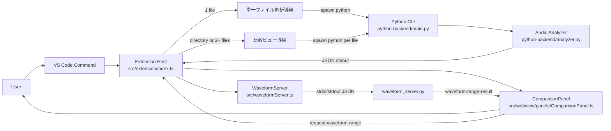
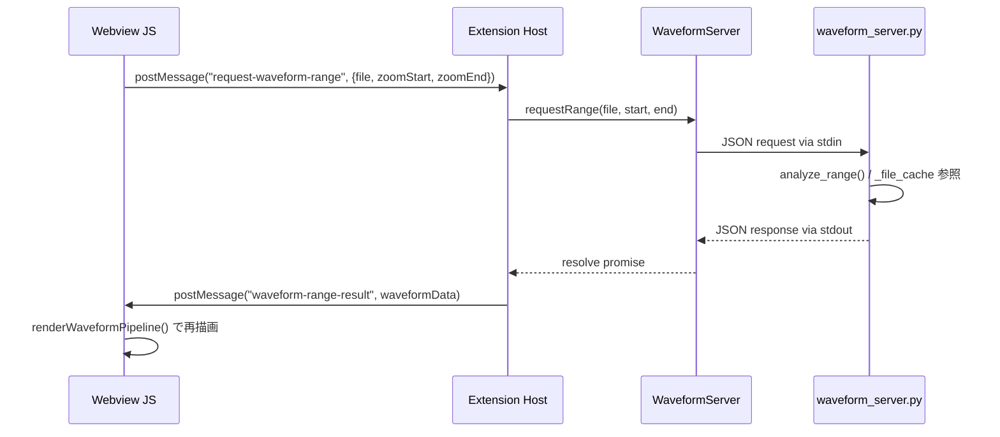
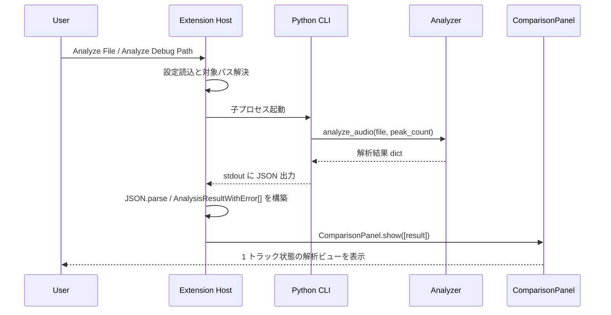
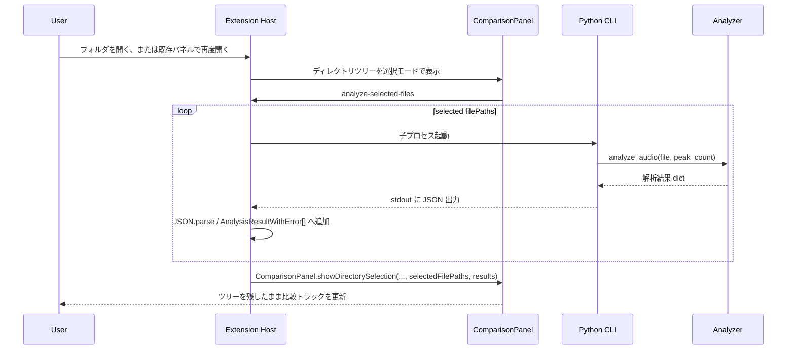

# Audio Wandas Analyzer Architecture

## 概要

このプロジェクトは、VS Code 拡張機能のフロントエンドと Python 製の解析バックエンドを分離した三層構成です。現在のユーザー導線は次の 2 系統に分かれています。

- 単一ファイル解析: ファイルを 1 件選択して即座に解析し、1 トラック状態の ComparisonPanel で確認する
- 比較ビュー: ディレクトリ選択または複数ファイル再選択のあと、対象を絞り込んで順次解析し、複数トラック状態の ComparisonPanel で比較する

各層の役割:

- Extension Host 層: コマンド登録、設定取得、ファイル選択、Python プロセス起動を担当
- Python Backend 層: 音声解析、数値計算、JSON 形式の結果生成を担当
- Webview UI 層: 比較パネル描画、ズームやホバーなどのインタラクションを担当

設計上の主眼は、VS Code 固有処理と信号処理ロジックを切り離し、UI と解析処理を疎結合に保つことです。

## 全体構成



## ユーザーフロー

### 1. 単一ファイル解析

1 件の音声ファイルを選択し、その場で解析して表示する最短導線です。内部では `runAnalysis()` を 1 回だけ呼び、返ってきた `AnalysisResult` を `AnalysisResultWithError[]` の 1 要素配列として `ComparisonPanel.show()` に渡します。したがって UI 上は比較パネルでも、実際には単一トラックの詳細閲覧として振る舞います。

### 2. 比較ビュー

複数ファイルを対象に解析して、共通タイムライン上で比較する導線です。開始点は 2 通りあります。

- フォルダを選択し、配下の対応音声ファイル群をツリーから選択して対象を確定する
- フォルダを選択し、配下の対応音声ファイル群をツリーから逐次チェックして比較対象を増減させる
- 単一ファイルを開いたあと、ツールバーから別のファイルまたはフォルダを開いて同じパネルを再利用する

ディレクトリ入力では、まず extension 側が `DirectoryTreeNode[]` を構築し、ComparisonPanel を選択モードで開きます。初期状態ではトラックは空です。Webview から返った選択済みファイル一覧を extension 側で再検証したあとに `runAnalysis()` をファイルごとに繰り返し、成功トラックと失敗トラックを含む `AnalysisResultWithError[]` を同じ選択モード panel に再注入します。これによりツリーを閉じずに、右側の比較トラックだけを即時更新できます。

## コンポーネント責務

### 1. Extension Host

対象: [src/extension/index.ts](../src/extension/index.ts)

責務:

- VS Code コマンド `audioWandasAnalyzer.analyzeFile` と `audioWandasAnalyzer.analyzeDebugFile` を登録する
- 対象の音声ファイルまたはディレクトリを選択または解決する
- 受け取った対象を単一ファイル解析導線または比較ビュー導線へ振り分ける
- Webview から `select-target`、`analyze-selected-files`、`request-waveform-range` を受け取る
- 設定値 `pythonCommand`、`defaultPeakCount`、`debugFilePath` を読み込む
- Python バックエンドを子プロセスとして起動する
- 標準出力の JSON を `AnalysisResult` として解釈し、失敗時は `error` 付きの結果へ変換して `AnalysisResultWithError[]` に蓄積する
- ディレクトリ指定時は `ComparisonPanel` を選択モードで開き、チェック変更のたびに同じ panel 内のトラック表示を更新する
- 失敗時は VS Code 通知にエラーを表示する

特徴:

- バックエンドとの境界はプロセス実行と JSON 入出力だけに限定されている
- 解析ロジックを TypeScript 側に持たないため、UI 修正と数値処理修正を独立して進めやすい
- 単一ファイルと複数ファイルの差は主に入力本数だけで、描画面は共通化されている

### 2. WaveformServer

対象: [src/waveformServer.ts](/workspaces/audio-wandas-analyzer/src/waveformServer.ts)

責務:

- `python-backend/waveform_server.py` を常駐子プロセスとして起動・管理する
- 改行区切り JSON の IPC (stdin/stdout) でズーム範囲の高解像度波形をオンデマンドに取得する
- ファイルキャッシュを持つサーバープロセスへのリクエストを多重化する

設計上のポイント:

- 初回解析時の全データ取得と分離することで、ズーム時の高解像度取得を低レイテンシで実現している
- サーバープロセスはファイルを `_file_cache` に保持するため、同一ファイルへの連続リクエストで再読み込みが発生しない

### 3. Python CLI Entry Point

対象: [python-backend/main.py](../python-backend/main.py)

責務:

- コマンドライン引数 `--file` と `--peaks` を受け取る
- `analyze_audio` を呼び出す
- 解析結果を JSON として標準出力に書き出す
- 例外発生時は標準エラー出力にメッセージを出し、非ゼロ終了コードで終了する

特徴:

- CLI を薄く保つことで、解析本体のテストや再利用をしやすくしている
- VS Code 拡張以外の呼び出し元を将来的に追加する場合も、この境界を流用しやすい

### 4. Audio Analyzer

対象: [python-backend/analyzer.py](../python-backend/analyzer.py)

責務:

- `wandas.read_wav()` による音声データ読み込み
- チャンネル向きの正規化
- RMS、ピーク値、優勢周波数の算出
- 波形エンベロープ生成（`decimator.py` 経由）
- スペクトログラム生成と可視化向けの縮約
- UI が扱いやすい辞書構造への整形

設計上のポイント:

- 大きな音声データをそのまま UI に渡さず、波形は最大 1200 点、時間方向スペクトログラムは最大 720 ビン、周波数方向は最大 192 ビンへ圧縮している
- 数値データを可視化用に事前整形することで、Webview 側は描画ロジックに集中できる
- チャンネルごとに独立した要約を返すため、多チャンネル音声でも同一描画パターンを再利用できる

### 5. Decimator

対象: [python-backend/decimator.py](/workspaces/audio-wandas-analyzer/python-backend/decimator.py)

責務:

- バケット単位の argmin/argmax で波形エンベロープを生成する
- タイムスタンプをファイル全体に対して正規化した `minT`/`maxT` として返す

設計上のポイント:

- 正規化済みタイムスタンプは Webview 側の `[0, 1]` ファイル座標系に直接マッピングされる

### 6. Range Analyzer / Waveform Server (Python)

対象: [python-backend/range_analyzer.py](/workspaces/audio-wandas-analyzer/python-backend/range_analyzer.py) / [python-backend/waveform_server.py](/workspaces/audio-wandas-analyzer/python-backend/waveform_server.py)

責務:

- `range_analyzer.py`: 指定範囲のみ `soundfile` で読み込み、高解像度波形を返す
- `waveform_server.py`: 常駐ループで stdin の JSON リクエストを受け、`analyze_range()` を呼んで結果を stdout に返す。読み込み済みファイルを `_file_cache` に保持する

### 7. ComparisonPanel

対象: [src/webview/panels/ComparisonPanel.ts](../src/webview/panels/ComparisonPanel.ts)

責務:

- `AnalysisResultWithError[]` を HTML とインラインスクリプトへ埋め込む
- 1 件のときは単一トラック解析ビュー、2 件以上のときは比較ビューとして描画する
- 表示モードは縦積み（stacked）のみ
- 共通タイムルーラー、ズーム、パン、カーソル同期、トラックごとの再生操作を処理する
- ズーム時に `request-waveform-range` を WaveformServer 経由で送り、高解像度波形をオンデマンドに取得する
- 解析失敗トラックをエラー表示のまま比較対象に残す

設計上のポイント:

- 単一ファイル、ディレクトリ選択、複数ファイル比較のすべてで `ComparisonPanel` に統一されている
- 比較件数に応じてタイトルとレイアウト密度だけが変わり、基本的な描画パイプラインは共通である
- 波形描画は `media/comparisonWaveform.js`（Webview 内）と `src/webview/waveform/waveformRenderer.ts`（TypeScript 単体テスト用）が同一アルゴリズムを実装しており、常に同期を保つ

### 8. Waveform Renderer

対象: [src/panels/waveformRenderer.ts](/workspaces/audio-wandas-analyzer/src/panels/waveformRenderer.ts) / [media/comparisonWaveform.js](/workspaces/audio-wandas-analyzer/media/comparisonWaveform.js)

責務:

3 層の純粋関数パイプラインで波形を描画する:

1. **CoordTransform** (`makeCoordTransform`): ファイル正規化時刻 `tNorm ∈ [0,1]` をキャンバス X 座標へ変換
2. **Decimation** (`computeViewRange` + `decimateBuckets`): 表示範囲のバケットを選択し argmin/argmax 間引きを行う
3. **Painting** (`paintDecimatedPoints`): Canvas API を呼び出す唯一の層

設計上のポイント:

- Canvas 依存を Painting 層のみに閉じることで、TypeScript 単体テストが Canvas なしで実行できる
- `waveformRenderer.ts` と `media/comparisonWaveform.js` は同じアルゴリズムを持つ。描画ロジック変更時は両方を更新し `npm test` で乖離を検出する

### 9. Range Request Policy

対象: [src/panels/rangeRequestPolicy.ts](/workspaces/audio-wandas-analyzer/src/panels/rangeRequestPolicy.ts)

責務:

- `isCacheSufficient`: 現在のキャッシュデータでズーム表示に十分かを判定する
- `computeReqBounds`: リクエストすべき範囲を計算する

設計上のポイント:

- リクエスト判定ロジックを ComparisonPanel から分離し、単独でテスト可能にしている

### 10. Shared Analysis Types

対象: [src/shared/analysis/analysisTypes.ts](../src/shared/analysis/analysisTypes.ts)

責務:

- `AnalysisResult`、`AnalysisResultWithError`、`DirectoryTreeNode` など、Extension Host と Webview の境界で共有する型を定義する
- Python バックエンドの JSON 契約と TypeScript 側のデータ構造を同期させる

設計上のポイント:

- UI 実装から型定義を分離し、表示層の入れ替えや削除が型契約へ波及しないようにしている
- `src/extension/index.ts` と `src/webview/panels/ComparisonPanel.ts` の両方が同じ型を参照することで、単一ファイル解析と比較ビューのデータモデルを統一している

## 実行シーケンス

### オンデマンド高解像度波形取得（ズーム時）



### 単一ファイル解析



### 比較ビュー



## データフロー

### 入力

- ユーザーが選択した音声ファイルパス、またはディレクトリ選択 UI で確定した音声ファイルパス群、または `debugFilePath`
- VS Code 設定値

### 中間データ

- Python 側で `wandas` が返す音声信号オブジェクト
- NumPy 配列に変換したチャンネル別サンプル列
- 集約済みの波形エンベロープと正規化済みスペクトログラム

### 出力

Python 側の正常系レスポンスは `AnalysisResult` として解釈し、Extension Host 側では失敗時の `error` を含めて `AnalysisResultWithError[]` に正規化して扱います。

正常系の `AnalysisResult` は概ね以下の構造です。

```ts
interface AnalysisResult {
  filePath: string;
  fileName: string;
  sampleRateHz: number;
  durationSeconds: number;
  channelCount: number;
  sampleCount: number;
  channels: ChannelSummary[];
}
```

各 `ChannelSummary` は以下を保持します。

- ラベル
- RMS
- Peak absolute value
- 優勢周波数の配列
- 波形エンベロープ
- スペクトログラム

この構造により、バックエンドと UI の依存関係は明確で、互いの内部実装を知らなくても境界契約だけで接続できます。

失敗を含む UI 側の結果モデルは以下です。

```ts
interface AnalysisResultWithError extends AnalysisResult {
  error?: string;
}
```

この形により、比較対象の一部だけが解析失敗しても、パネル全体は閉じずに他トラックを表示し続けられます。

## ディレクトリ構成

```text
src/
  extension/
    index.ts                VS Code 拡張のエントリポイント
    waveformServer.ts       波形レンジ要求用の永続 Python 子プロセス
  shared/
    analysis/
      analysisTypes.ts      共有型定義
    utils/
      audioTarget.ts        Webview メッセージ判定・音声拡張子判定
      directorySelection.ts ディレクトリ選択の純粋関数
      startupDebug.ts       起動時デバッグ挙動の判定
      webviewEscaping.ts    Webview 埋め込み文字列のエスケープ
  webview/
    panels/
      ComparisonPanel.ts    単一ファイル表示と比較表示の Webview UI
    waveform/
      waveformRenderer.ts   波形描画パイプライン（Canvas 非依存・TypeScript）
      rangeRequestPolicy.ts 波形レンジ取得ポリシー
  test/
    waveformRenderer.test.ts
    rangeRequestPolicy.test.ts
    renderScript.integration.test.ts
  e2e/
    suite/index.ts          VS Code E2E スモークテスト
python-backend/
  main.py                   Python CLI エントリポイント
  analyzer.py               全ファイル解析ロジック
  decimator.py              バケット argmin/argmax 波形エンベロープ生成
  range_analyzer.py         範囲指定高解像度波形取得
  waveform_server.py        常駐サーバーループ（_file_cache 付き）
media/
  comparisonWaveform.js     waveformRenderer.ts の Webview 用 JS 実装
  debug/
    sine-440.wav            デバッグ用の単一音声ファイル
    (複数 wav)              マルチトラックテスト用
docs/
  architecture.md           本資料
  superpowers/
    specs/                  設計仕様書
    plans/                  実装計画書
```

## 依存関係

### TypeScript / VS Code 側

- VS Code Extension API
- Node.js `child_process`
- Node.js `path`

### Python 側

- `wandas`: 音声読み込み、FFT、STFT などの信号処理
- `numpy`: チャンネル整形、可視化向け集約、データ圧縮

## 設定と実行境界

プロジェクト設定の主要な境界は以下です。

- `audioWandasAnalyzer.pythonCommand`: Python 実行コマンド
- `audioWandasAnalyzer.defaultPeakCount`: チャンネルごとの優勢周波数件数
- `audioWandasAnalyzer.debugFilePath`: デバッグ用音声ファイルまたはディレクトリのパス

この構成により、実行環境の違いは主に Python コマンド解決へ閉じ込められます。

## 例外処理方針

- Python 側で例外が起きた場合は CLI が標準エラー出力へメッセージを書き、終了コード 1 を返す
- TypeScript 側は終了コードと標準エラー出力を見て失敗扱いにする
- JSON 解析失敗も Extension Host で検出し、ユーザーへ通知する

この方針により、UI 層に Python 例外の詳細を持ち込まず、障害点を Extension Host で集約できる設計になっています。

## 拡張ポイント

将来的な拡張は主に次の 3 箇所に集約できます。

1. Python 側の解析項目追加
   `analyzer.py` の戻り値へ新しいメトリクスを追加し、`AnalysisResult` に追従させる
2. Webview の可視化追加
  既存のチャンネルループに新しいセクションを加えるだけで、マルチトラック比較レイアウトを維持したまま拡張しやすい
3. コマンド追加
   `src/extension/index.ts` で別の入力導線やバッチ解析導線を定義できる。現状でも単一ファイルとディレクトリの両方を受け付ける

## 現状の制約

- Webview は解析結果を一括注入する方式なので、超大規模データを段階読み込みする構成ではない
- バックエンド呼び出しは同期的な単発プロセス実行であり、継続的なストリーミング解析には未対応
- 入力フォーマットの取り扱いは現状 `wandas.read_wav()` に依存しているため、README 上の拡張子一覧と実際のデコード対応範囲は Python ライブラリ側の能力に左右される

## 開発時の判断基準

- VS Code API に触れる変更は Extension Host に閉じ込める
- 数値処理や信号処理は Python 側へ寄せる
- UI 用のデータ圧縮はバックエンドで済ませ、Webview には描画に必要な粒度だけ渡す
- TypeScript と Python の境界変更時は、`AnalysisResult` と JSON 出力の整合性を最優先で確認する
