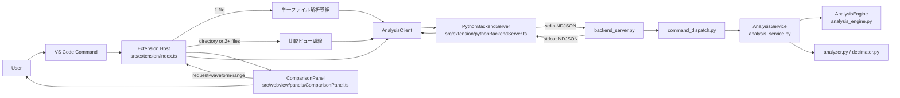
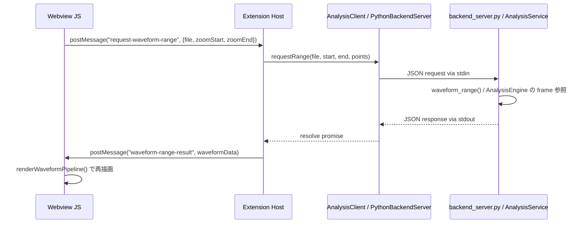
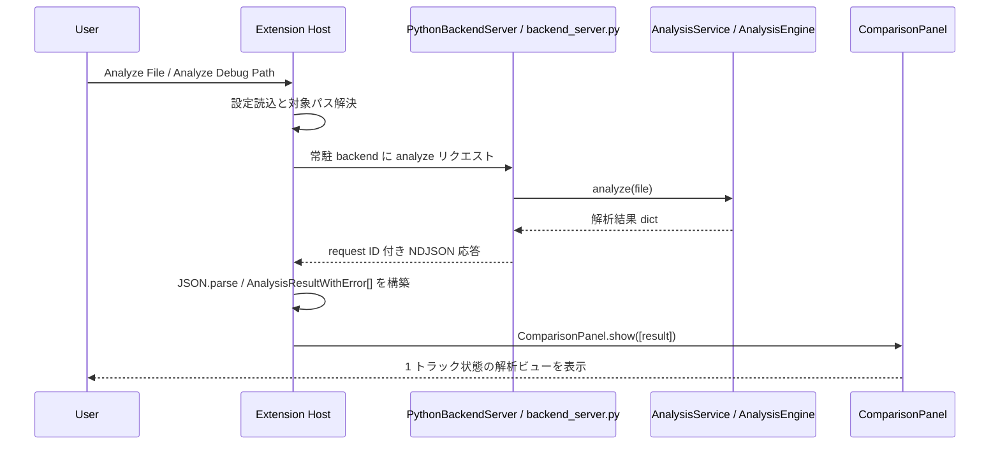
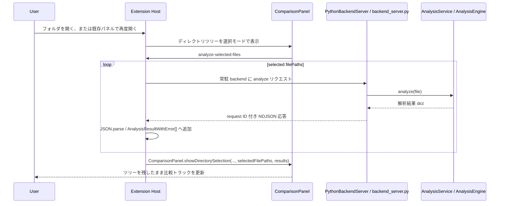

# Audio Wandas Analyzer Architecture

## 概要

このプロジェクトは、VS Code 拡張機能のフロントエンドと Python 製の解析バックエンドを分離した三層構成です。現在のユーザー導線は次の 2 系統に分かれています。

- 単一ファイル解析: ファイルを 1 件選択して即座に解析し、1 トラック状態の ComparisonPanel で確認する
- 比較ビュー: ディレクトリ選択または複数ファイル再選択のあと、対象を絞り込んで順次解析し、複数トラック状態の ComparisonPanel で比較する

各層の役割:

- Extension Host 層: コマンド登録、設定取得、ファイル選択、Python プロセス起動を担当
- Python Backend 層: 音声解析、数値計算、JSON 形式の結果生成を担当
- Webview UI 層: 比較パネル描画、ズームやホバーなどのインタラクションを担当

設計上の主眼は、VS Code 固有処理と信号処理ロジックを切り離し、UI と解析処理を疎結合に保つことです。

## Desktop / static Web の共通境界

Comparison UI と DSP は同じソースを使う。解析コマンドの型・応答検証は
`src/shared/protocol/backendProtocol.ts`、UI から host への型・入力検証は
`src/shared/protocol/panelMessages.ts` に置く。Worker の正常応答も native IPC と同じ
validator を通す。Web の load/unload/export-plan は Worker 専用であり共通7コマンド（`command_dispatch.COMMANDS`）と混同しない。

- `AnalysisClient` は analyze/detail/slice/range/export/recipe の要求を組み立てる。
  `executeLazyAnalysis` は detail/slice/range の UI 結果へ変換する。host は
  型付き request transport と表示中の calibration/STFT context を提供する。
- `runAnalysisBatch` は逐次処理、`SessionRequests` は世代・request ID・dispose 後の応答排除を担当する。
  Web の clear は世代を進めて再利用し、native Panel dispose は閉鎖する。再生成 Panel は別 session。
- `SourceResults` は結果 collection と owner の参照同一性を管理する。native は借用した directory cache を
  選択解除・detach 時にも保持し、revision 不一致だけを除去する。Web は所有 source の drop/clear 時に
  lease を無効化して Blob を解放する。Worker unload/terminate、許可パス、native 取消は adapter の責務。
- `AnalysisContextPolicy.current/discardStale` は native の校正 store を注入する。
  lazy request の明示 revision（0 を含む）は表示済み context として優先する。analyze は現 store の
  context を使い、一致した stale profile の破棄後だけ1回再試行する。取消 token は初回と再試行で共通。
  Web は policy なしで入力 context を使う。校正 UI/persistence を Web に追加したことにはならない。
  Panel は表示 hook で校正 listener を登録し、prototype や show メソッドを書き換えない。
- `ComparisonSessionController`（`src/shared/session/`）は panel message の解釈を一度だけ持つ。
  設定保存、再解析の start/update/end 包絡と世代ゲート、lazy 結果への変換と公開判定、
  WAV 区間・レポートの書き出し手順、未対応操作の通知経路はここにある。host は
  `ComparisonSessionPorts` で scope（公開可否）、transport、設定ストア、ダイアログ、
  ソース所有を注入する。native `PanelController` と Web `staticHost` は port 実装だけを持ち、
  同期的な port は同一 tick で backend command に到達する。active source が 0 件の再解析は
  設定保存のみで包絡を送らない。
- `OrderedSelection` は順序・重複排除・再追加の規則を担当する。native の tree による
  パス許可検証を UI 側の選択状態で代替しない。
- `exportWavRegions` は区間計画・順序・衝突しない名前を共有する。sink は書込み先と
  失敗方針を提供する。native は個別失敗後も継続し、Web は予算検証後に失敗で中断する。
- spectrogram 設定は `SpectrogramSettingsStore.get/update` を通す。
  workspaceState と localStorage、校正の realpath と永続化、保存ダイアログと Blob/ZIP は adapter に残す。
- Python の `command_dispatch.py` は検証と service 呼出しだけを持つ。
  `backend_server.py` は native 起動・heartbeat・NDJSON、`browser_service.py` は
  virtual source と Web 上限を担当する。Web 配布物には native transport を含めない。

- Recipe は `src/shared/recipe/` の `RecipeFlow` が一覧・選択・`{{selection}}` 置換・実行・表示の手順を持つ。
  native は recipes ディレクトリ、QuickPick、子プロセス `recipe_runner.py`、ChartSpec Panel を port で渡す。
  Web は build 時の `recipes/manifest.json`、prompt、Worker の `run-recipe` command、同一 origin の
  `chartSpec.js` を読み込む frame を渡す。Python 側は `recipe_runner.run_recipe(recipe, base_dir, load)` の
  loader 注入で、ファイルパスではなく engine が保持する frame を入力にできる。`requires` を宣言した recipe は
  runtime lock に無い配布物（mosqito）を欠くと Web 一覧で実行不可と表示する。
  ChartSpec 文書の CSS と globals は `chartSpecDocument.ts` に置き、render script は両 host が同じ文字列を使う。

校正設定 UI、フォルダ選択、codec の Web 対応範囲は増やしていない。
新しい共通処理は両 host が実際に参照する。host 名による分岐で共通ファイルを膨らませない。

### 共有率の測り方と目標

`python3 scripts/audit-runtime-sharing.py --baseline 277bdd7a9a92b63a6e8820368ca29ea3bb44b745 --output test-results/runtime-sharing.json`
で、基準と作業中の全 production source の到達元・ファイル数・非空行数を比較できる。
型 import と build の明示 root を含む source closure であり、全行実行や機能同等性の割合ではない。
HTML/CSS は所在する TS に含め、tests、vendor、生成物、docs、build/dev tools、設定とデータ asset は除外する。
`verify` は shallow checkout でも動く現状監査を実行する。

基準は共有 31 / 全体 61 ファイル (50.82%)、非空行 10,394 / 15,960 (65.13%)。
80% は目標であり達成済みではない。native 専用の Python 環境管理、コマンド登録、Panel、
ファイル権限は adapter として残るため、ファイル数での 80% は同じ分母では保証できない。
行数ベースは Recipe の Web 対応と共通 session controller で 80% 近傍に達する。
独立した adapter を合併して数を減らす、共通 file を細分化する、未使用 import を追加する方法は採らない。
率と併せて、同じコマンド変換・区間計画・選択規則を一度の変更で両版へ反映できるかを評価する。

## 全体構成


```mermaid
flowchart LR
  User[User] --> Command[VS Code Command]
  Command --> Extension[Extension Host\nsrc/extension/index.ts]

  Extension -->|1 file| Single[単一ファイル解析導線]
  Extension -->|directory or 2+ files| Compare[比較ビュー導線]

  Single --> Client[AnalysisClient]
  Compare --> Client
  Client --> Server[PythonBackendServer\nsrc/extension/pythonBackendServer.ts]
  Server -->|stdin NDJSON| Backend[backend_server.py]
  Backend --> Dispatch[command_dispatch.py]
  Dispatch --> Service[AnalysisService\nanalysis_service.py]
  Service --> Engine[AnalysisEngine\nanalysis_engine.py]
  Service --> Analyzer[analyzer.py / decimator.py]
  Backend -->|stdout NDJSON| Server
  Server --> Client
  Extension --> Panel[ComparisonPanel\nsrc/webview/panels/ComparisonPanel.ts]
  Panel --> User
  Panel -->|request-waveform-range| Extension
  Extension --> Client
```

## ユーザーフロー

### 1. 単一ファイル解析

1 件の音声ファイルを選択し、その場で解析して表示する最短導線です。内部では `runAnalysis()` を 1 回だけ呼び、返ってきた `AnalysisResult` を `AnalysisResultWithError[]` の 1 要素配列として `ComparisonPanel.show()` に渡します。したがって UI 上は比較パネルでも、実際には単一トラックの詳細閲覧として振る舞います。

### 2. 比較ビュー

複数ファイルを対象に解析して、共通タイムライン上で比較する導線です。開始点は 2 通りあります。

- フォルダを選択し、配下の対応音声ファイル群をツリーから選択して対象を確定する
- フォルダを選択し、配下の対応音声ファイル群をツリーから逐次チェックして比較対象を増減させる
- 単一ファイルを開いたあと、ツールバーから別のファイルまたはフォルダを開いて同じパネルを再利用する

ディレクトリ入力では、まず extension 側が `DirectoryTreeNode[]` を構築し、ComparisonPanel を選択モードで開きます。初期状態ではトラックは空です。Webview から返った選択済みファイル一覧を extension 側で再検証したあとに `runAnalysis()` をファイルごとに繰り返し、成功トラックと失敗トラックを含む `AnalysisResultWithError[]` を同じ選択モード panel に再注入します。これによりツリーを閉じずに、右側の比較トラックだけを即時更新できます。

## コンポーネント責務

### 1. Extension Host

対象: [src/extension/index.ts](../src/extension/index.ts)

責務:

- VS Code コマンド `audioWandasAnalyzer.analyzeFile` と `audioWandasAnalyzer.analyzeDebugFile` を登録する
- 対象の音声ファイルまたはディレクトリを選択または解決する
- 受け取った対象を単一ファイル解析導線または比較ビュー導線へ振り分ける
- Webview から `select-target`、`analyze-selected-files`、`request-waveform-range` を受け取る
- 設定値 `pythonCommand`、`cacheMemoryMb`、`debugFilePath` を読み込む
- Python バックエンドを子プロセスとして起動する
- 標準出力の JSON を `AnalysisResult` として解釈し、失敗時は `error` 付きの結果へ変換して `AnalysisResultWithError[]` に蓄積する
- ディレクトリ指定時は `ComparisonPanel` を選択モードで開き、チェック変更のたびに同じ panel 内のトラック表示を更新する
- 失敗時は VS Code 通知にエラーを表示する

特徴:

- バックエンドとの境界はプロセス実行と JSON 入出力だけに限定されている
- 解析ロジックを TypeScript 側に持たないため、UI 修正と数値処理修正を独立して進めやすい
- 単一ファイルと複数ファイルの差は主に入力本数だけで、描画面は共通化されている

### 2. PythonBackendServer

対象: [src/extension/pythonBackendServer.ts](../src/extension/pythonBackendServer.ts)

責務:

- `python-backend/backend_server.py` を常駐子プロセスとして起動・管理する
- `AnalysisClient` の要求を request ID 付きの改行区切り JSON で送信し、応答を対応する Promise に返す
- ready、heartbeat、タイムアウト、取消、終了時の pending request を管理する

同じプロセスで初期解析と遅延解析を扱い、`AnalysisEngine` のファイル・STFT キャッシュを再利用する。

### 3. Python Backend Entry Point

対象: [python-backend/backend_server.py](../python-backend/backend_server.py) / [python-backend/command_dispatch.py](../python-backend/command_dispatch.py)

責務:

- stdin の NDJSON リクエストを検証し、`AnalysisService` に渡す
- 共通7コマンド（analyze、range、track-detail、release-track-detail、spectrum-slice、export-wav-loop、run-recipe）を dispatch する
- request ID 付きの結果または error を stdout に返す
- 起動通知・heartbeat と stderr の診断を提供する

検証と dispatch は Web の `browser_service.py` からも使う。

### 4. Audio Analyzer

対象: [python-backend/analyzer.py](../python-backend/analyzer.py)

責務:

- `AnalysisEngine` で読み込み・校正された frame から表示用の結果を生成する
- チャンネル向きの正規化
- ピーク値の算出
- 波形エンベロープ生成（`decimator.py` 経由）
- スペクトログラム生成と可視化向けの縮約
- UI が扱いやすい辞書構造への整形

設計上のポイント:

- 大きな音声データをそのまま UI に渡さず、波形は最大 1200 点、時間方向スペクトログラムは最大 720 ビン、周波数方向は最大 192 ビンへ圧縮している
- 数値データを可視化用に事前整形することで、Webview 側は描画ロジックに集中できる
- チャンネルごとに独立した要約を返すため、多チャンネル音声でも同一描画パターンを再利用できる

### 5. Decimator

対象: [python-backend/decimator.py](/workspaces/audio-wandas-analyzer/python-backend/decimator.py)

責務:

- バケット単位の argmin/argmax で波形エンベロープを生成する
- タイムスタンプをファイル全体に対して正規化した `minT`/`maxT` として返す

設計上のポイント:

- 正規化済みタイムスタンプは Webview 側の `[0, 1]` ファイル座標系に直接マッピングされる

### 6. AnalysisService / AnalysisEngine

対象: [python-backend/analysis_service.py](../python-backend/analysis_service.py) / [python-backend/analysis_engine.py](../python-backend/analysis_engine.py)

責務:

- `AnalysisEngine`: `wandas.read()` で読み込んだ frame と設定別 STFT をメモリ上限付き LRU キャッシュに保持する。ファイル更新時はキャッシュを無効化する
- `AnalysisService`: 初期要約、トラック詳細、カーソルスペクトル、波形範囲、WAV 区間書き出し、Recipe を処理する
- `waveform_range()`: 校正済みのキャッシュ frame を指定範囲で切り出し、`decimator.py` に渡す。同一ファイルを再読み込みしない

### 7. ComparisonPanel

対象: [src/webview/panels/ComparisonPanel.ts](../src/webview/panels/ComparisonPanel.ts)

責務:

- `AnalysisResultWithError[]` を HTML とインラインスクリプトへ埋め込む
- 1 件のときは単一トラック解析ビュー、2 件以上のときは比較ビューとして描画する
- 表示モードは縦積み（stacked）のみ
- 共通タイムルーラー、ズーム、パン、カーソル同期、トラックごとの再生操作を処理する
- ズーム時に `request-waveform-range` を AnalysisClient / PythonBackendServer 経由で送り、高解像度波形をオンデマンドに取得する
- 解析失敗トラックをエラー表示のまま比較対象に残す

設計上のポイント:

- 単一ファイル、ディレクトリ選択、複数ファイル比較のすべてで `ComparisonPanel` に統一されている
- 比較件数に応じてタイトルとレイアウト密度だけが変わり、基本的な描画パイプラインは共通である
- 波形描画の定義元は `src/webview/waveform/waveformRenderer.ts`。ビルドで生成した `dist/webview/comparisonWaveform.js` を Webview が読み込む

### 8. Waveform Renderer

対象: [src/webview/waveform/waveformRenderer.ts](../src/webview/waveform/waveformRenderer.ts) / [scripts/build-webview.js](../scripts/build-webview.js)

責務:

3 層の純粋関数パイプラインで波形を描画する:

1. **CoordTransform** (`makeCoordTransform`): ファイル正規化時刻 `tNorm ∈ [0,1]` をキャンバス X 座標へ変換
2. **Decimation** (`computeViewRange` + `decimateBuckets`): 表示範囲のバケットを選択し argmin/argmax 間引きを行う
3. **Painting** (`paintDecimatedPoints`): Canvas API を呼び出す唯一の層

設計上のポイント:

- Canvas 依存を Painting 層のみに閉じることで、TypeScript 単体テストが Canvas なしで実行できる
- TypeScript ソースを編集し、`npm run compile` で `dist/webview/comparisonWaveform.js` を生成する。生成物は手編集しない

### 9. Range Request Policy

対象: [src/webview/waveform/rangeRequestPolicy.ts](../src/webview/waveform/rangeRequestPolicy.ts)

責務:

- `isCacheSufficient`: 現在のキャッシュデータでズーム表示に十分かを判定する
- `computeReqBounds`: リクエストすべき範囲を計算する

設計上のポイント:

- リクエスト判定ロジックを ComparisonPanel から分離し、単独でテスト可能にしている

### 10. Shared Analysis Types

対象: [src/shared/analysis/analysisTypes.ts](../src/shared/analysis/analysisTypes.ts)

責務:

- `AnalysisResult`、`AnalysisResultWithError`、`DirectoryTreeNode` など、Extension Host と Webview の境界で共有する型を定義する
- Python バックエンドの JSON 契約と TypeScript 側のデータ構造を同期させる

設計上のポイント:

- UI 実装から型定義を分離し、表示層の入れ替えや削除が型契約へ波及しないようにしている
- `src/extension/index.ts` と `src/webview/panels/ComparisonPanel.ts` の両方が同じ型を参照することで、単一ファイル解析と比較ビューのデータモデルを統一している

## 実行シーケンス

### オンデマンド高解像度波形取得（ズーム時）


```mermaid
sequenceDiagram
    participant W as Webview JS
    participant E as Extension Host
    participant WS as AnalysisClient / PythonBackendServer
    participant P as backend_server.py / AnalysisService

    W->>E: postMessage("request-waveform-range", {file, zoomStart, zoomEnd})
    E->>WS: requestRange(file, start, end, points)
    WS->>P: JSON request via stdin
    P->>P: waveform_range() / AnalysisEngine の frame 参照
    P-->>WS: JSON response via stdout
    WS-->>E: resolve promise
    E->>W: postMessage("waveform-range-result", waveformData)
    W->>W: renderWaveformPipeline() で再描画
```

### 単一ファイル解析


```mermaid
sequenceDiagram
    participant U as User
    participant E as Extension Host
    participant P as PythonBackendServer / backend_server.py
    participant A as AnalysisService / AnalysisEngine
    participant C as ComparisonPanel

    U->>E: Analyze File / Analyze Debug Path
    E->>E: 設定読込と対象パス解決
    E->>P: 常駐 backend に analyze リクエスト
    P->>A: analyze(file)
    A-->>P: 解析結果 dict
    P-->>E: request ID 付き NDJSON 応答
    E->>E: JSON.parse / AnalysisResultWithError[] を構築
    E->>C: ComparisonPanel.show([result])
    C-->>U: 1 トラック状態の解析ビューを表示
```

### 比較ビュー


```mermaid
sequenceDiagram
    participant U as User
    participant E as Extension Host
    participant C as ComparisonPanel
    participant P as PythonBackendServer / backend_server.py
    participant A as AnalysisService / AnalysisEngine

    U->>E: フォルダを開く、または既存パネルで再度開く
    E->>C: ディレクトリツリーを選択モードで表示
    C->>E: analyze-selected-files
    loop selected filePaths
        E->>P: 常駐 backend に analyze リクエスト
        P->>A: analyze(file)
        A-->>P: 解析結果 dict
        P-->>E: request ID 付き NDJSON 応答
        E->>E: JSON.parse / AnalysisResultWithError[] へ追加
    end
    E->>C: ComparisonPanel.showDirectorySelection(..., selectedFilePaths, results)
    C-->>U: ツリーを残したまま比較トラックを更新
```

## データフロー

### 入力

- ユーザーが選択した音声ファイルパス、またはディレクトリ選択 UI で確定した音声ファイルパス群、または `debugFilePath`
- VS Code 設定値

### 中間データ

- Python 側で `wandas` が返す音声信号オブジェクト
- NumPy 配列に変換したチャンネル別サンプル列
- 集約済みの波形エンベロープと正規化済みスペクトログラム

### 出力

Python 側の正常系レスポンスは `AnalysisResult` として解釈し、Extension Host 側では失敗時の `error` を含めて `AnalysisResultWithError[]` に正規化して扱います。

正常系の `AnalysisResult` は概ね以下の構造です。

```ts
interface AnalysisResult {
  filePath: string;
  fileName: string;
  sampleRateHz: number;
  durationSeconds: number;
  channelCount: number;
  sampleCount: number;
  channels: ChannelSummary[];
}
```

各 `ChannelSummary` は以下を保持します。

- ラベル
- Peak absolute value
- 波形エンベロープ
- 遅延解析で取得したスペクトログラム（未取得時は `null`）

この構造により、バックエンドと UI の依存関係は明確で、互いの内部実装を知らなくても境界契約だけで接続できます。

失敗を含む UI 側の結果モデルは以下です。

```ts
interface AnalysisResultWithError extends AnalysisResult {
  error?: string;
}
```

この形により、比較対象の一部だけが解析失敗しても、パネル全体は閉じずに他トラックを表示し続けられます。

## ディレクトリ構成

```text
src/
  extension/
    index.ts                VS Code 拡張のエントリポイント
    pythonBackendServer.ts  解析要求用の永続 Python 子プロセス
  shared/
    analysis/
      analysisTypes.ts      共有型定義
    utils/
      audioTarget.ts        Webview メッセージ判定・音声拡張子判定
      directorySelection.ts ディレクトリ選択の純粋関数
      startupDebug.ts       起動時デバッグ挙動の判定
      webviewEscaping.ts    Webview 埋め込み文字列のエスケープ
  webview/
    panels/
      ComparisonPanel.ts    単一ファイル表示と比較表示の Webview UI
    waveform/
      waveformRenderer.ts   波形描画パイプライン（Canvas 非依存・TypeScript）
      rangeRequestPolicy.ts 波形レンジ取得ポリシー
  test/
    waveformRenderer.test.ts
    rangeRequestPolicy.test.ts
    renderScript.integration.test.ts
  e2e/
    suite/index.ts          VS Code E2E スモークテスト
python-backend/
  backend_server.py         常駐 NDJSON サーバー
  command_dispatch.py       共通7コマンドの入力検証と dispatch
  analysis_service.py       解析コマンドの実装
  analysis_engine.py        音声 frame と STFT のキャッシュ
  analyzer.py               frame から表示用結果を生成
  decimator.py              バケット argmin/argmax 波形エンベロープ生成
dist/webview/               compile による生成物
  comparisonWaveform.js     waveformRenderer.ts の Webview バンドル
  comparisonRuntime.js      比較ビューの runtime バンドル
media/
  debug/
    sine-440.wav            デバッグ用の単一音声ファイル
    (複数 wav)              マルチトラックテスト用
docs/
  architecture.md           本資料
  superpowers/
    specs/                  設計仕様書
    plans/                  実装計画書
```

## 依存関係

### TypeScript / VS Code 側

- VS Code Extension API
- Node.js `child_process`
- Node.js `path`

### Python 側

- `wandas`: 音声読み込み、FFT、STFT などの信号処理
- `numpy`: チャンネル整形、可視化向け集約、データ圧縮

## 設定と実行境界

プロジェクト設定の主要な境界は以下です。

- `audioWandasAnalyzer.pythonCommand`: Python 実行コマンド
- `audioWandasAnalyzer.cacheMemoryMb`: 常駐 Python バックエンドの音声キャッシュ上限
- `audioWandasAnalyzer.debugFilePath`: デバッグ用音声ファイルまたはディレクトリのパス

この構成により、実行環境の違いは主に Python コマンド解決へ閉じ込められます。

## 例外処理方針

- リクエスト処理中の Python 例外は request ID 付きの error 応答として返す
- TypeScript 側は error 応答、起動失敗、タイムアウト、プロセス終了を対応する要求の失敗として扱う
- JSON 解析失敗も Extension Host で検出し、ユーザーへ通知する

この方針により、UI 層に Python 例外の詳細を持ち込まず、障害点を Extension Host で集約できる設計になっています。

## 拡張ポイント

将来的な拡張は主に次の 3 箇所に集約できます。

1. Python 側の解析項目追加
   `analyzer.py` の戻り値へ新しいメトリクスを追加し、`AnalysisResult` に追従させる
2. Webview の可視化追加
  既存のチャンネルループに新しいセクションを加えるだけで、マルチトラック比較レイアウトを維持したまま拡張しやすい
3. コマンド追加
   `src/extension/index.ts` で別の入力導線やバッチ解析導線を定義できる。現状でも単一ファイルとディレクトリの両方を受け付ける

## 現状の制約

- Webview は解析結果を一括注入する方式なので、超大規模データを段階読み込みする構成ではない
- 常駐 backend は要求ごとに処理し、継続的なストリーミング解析には未対応
- 入力フォーマットの取り扱いは現状 `wandas.read()` に依存しているため、README 上の拡張子一覧と実際のデコード対応範囲は Python ライブラリ側の能力に左右される

## 開発時の判断基準

- VS Code API に触れる変更は Extension Host に閉じ込める
- 数値処理や信号処理は Python 側へ寄せる
- UI 用のデータ圧縮はバックエンドで済ませ、Webview には描画に必要な粒度だけ渡す
- TypeScript と Python の境界変更時は、`AnalysisResult` と JSON 出力の整合性を最優先で確認する

## Shared spectrogram GUI kernel (stage one)

The canonical source and synchronization tool live in
[kasahart/wandas-gui](https://github.com/kasahart/wandas-gui).
`src/shared/gui-core` is a commit/hash-pinned MIT source snapshot with LICENSE and
NOTICE. `scripts/sync-gui-core.mjs` is also pinned to that repository; compile
checks source, attribution and tool hashes without contacting the network.
Update the clean canonical checkout, commit it, then run:

```sh
node scripts/sync-gui-core.mjs --from <wandas-gui checkout> --into src/shared/gui-core
npm run verify
```

Insight uses the same source and tool in its own snapshot destination. The
consumer-local package manifest is a source-entry shim, not the upstream build
manifest. Runtime dependencies remain zero. `spectrogramRaster.ts` retains
Analyzer's track mapping, calibrated units/references and legacy interval policy.
The kernel reuses ImageData's buffer; axes, cursor, cache, IPC and DSP stay here.
Physical STFT/group axes and boundary corrections remain separate product work.
